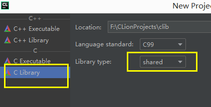
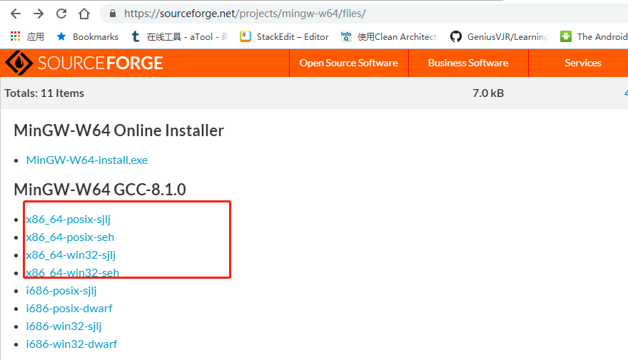

## 使用 CLion 生成 dll 文件
> windows 使用 dll, linux 使用 so
1. 创建项目

2. 创建头文件，实现头文件的函数定义
3. 在 `CMakeLists.txt` 中添加  
`add_library(test SHARED jni01.c com_company_JniTest.h)`
4. Ctrl + F9， build 项目
5. 在目录 cmake-build-debug 找到 生成的 dll 文件

## 如何生成 x64 位的 dll
使用 clion 提供的下载连接下载的工具链默认生成的为 32 位的dll


在 64 位系统中调用会出现如下错误
```java.lang.UnsatisfiedLinkError: F:\git_javaweb\jnidemo\lib\libjnitest.dll: Can't load IA 32-bit .dll on a AMD 64-bit platform```  
要解决这个错误需要生成 64 位的 dll，需要自行下载工具链
1. 访问官方网址http://www.mingw-w64.org （不要去 www.mingw.org，这个的比较旧）
2. 点击 download，选择 mingW-W64-builds, 点击 Sourceforge （可能需要翻墙），取消自动下载
3. 往下滑动选中 MinGW-builds
 
4. 可以点击 download，这时下载的是 exe 文件，可以选择 files 选项下载压缩文件，往下滑
https://sourceforge.net/projects/mingw-w64/files/
 
5. 选择 x86_64-posix-seh 下载，解压后配置工具链
 > x86_64 为运行在 64 位系统上， i686 为运行在 32 位系统上
 seh结尾是纯64位编译。sjlj结尾是32 64两种编译
 posix通常用于跨平台，比win32兼容性好一些。
 
 * 以上步骤存在问题，可以访问 http://www.mingw-w64.org，点击` v6.0.0: 2018-09-17`，选择 files，直到如下链接
 https://sourceforge.net/projects/mingw-w64/files/Toolchains targetting Win64/Personal Builds/mingw-builds/8.1.0/threads-posix/seh/x86_64-8.1.0-release-posix-seh-rt_v6-rev0.7z/download
 
 
 **不要使用 cygwin**
  
## 参考资料
* https://tieba.baidu.com/p/5487544851?red_tag=2058336523


